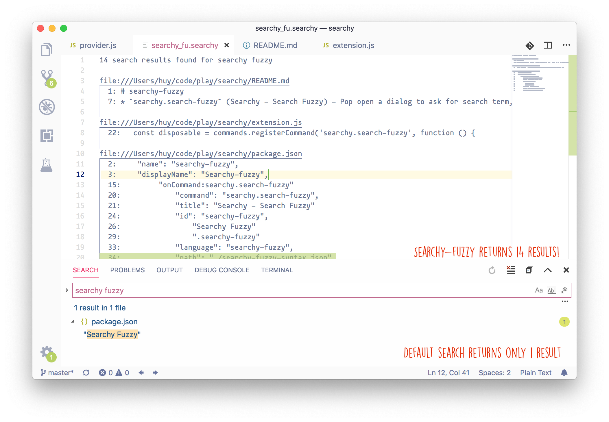

# searchy-fuzzy

A fork from [malkomalko/searchy](https://github.com/malkomalko/searchy), with some enhancement for more flexibility.

## Commands

* `searchy.search-fuzzy` (Searchy - Search Fuzzy) - Pop open a dialog to ask for search term, and open the results in a nice read only document.  This uses ripgrep.